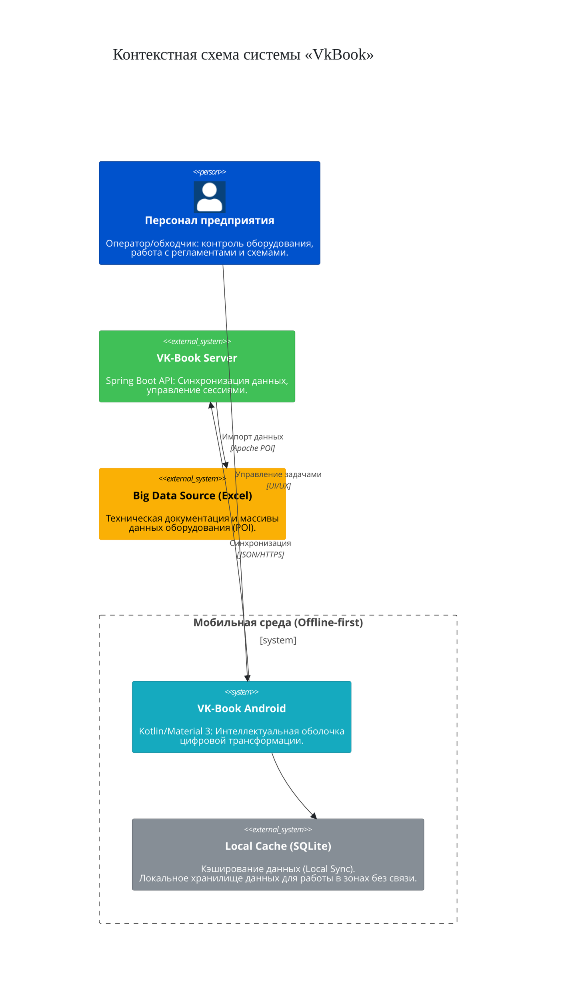
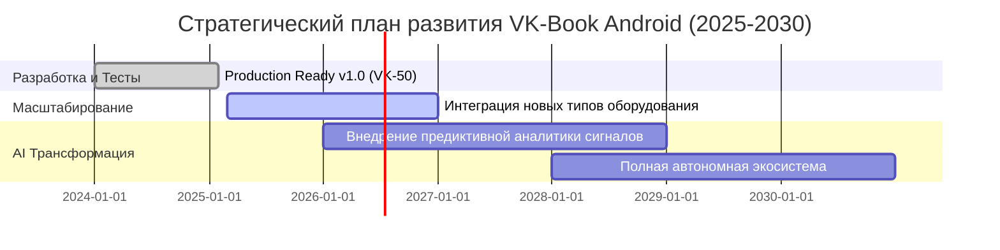

# 📱 VkBook Android - Technical Showcase

> **Интеллектуальная экосистема цифровой трансформации мобильных рабочих мест (Industrial/Engineering)**

**Статус:** `Production Ready (v1.0)`  
**Роль:** Technical Product Manager / Системный архитектор (AI-native подход)

VkBook Android — это полнофункциональная мобильная экосистема, спроектированная для полной оцифровки рабочих процессов сменного персонала на высокотехнологичных и инженерных объектах. Система заменяет бумажную рутину единой цифровой средой, минимизируя риски человеческого фактора.

---

## ⚠️ Вызовы бизнеса (Product Discovery)

До внедрения системы операционная деятельность сталкивалась с критическими «болями»:

* **Информационный хаос:** Сменный персонал тратил значительное время на поиск данных в бумажных журналах и разрозненных Excel-таблицах.
* **Операционные риски:** Огромное количество оборудования приводило к ошибкам навигации у новичков и ошибкам по невнимательности у опытных сотрудников.
* **Разрыв коммуникаций:** Отсутствие мобильного доступа к схемам в зонах без стационарных ПК замедляло технологический процесс.

---

## ✨ Ключевые функции и модули

1. **Интеллектуальное управление регламентами (Digital Checklists)** Трансформация графиков в систему интерактивных задач с подсветкой текущего часа. Исключает пропуски замеров и ошибки по невнимательности.
2. **Модуль технической визуализации (Schematics Tab)** Мгновенный доступ к планам и схемам на объекте. Позволяет находить нужную арматуру за **5 минут** вместо длительных поисков.
3. **Единый справочник оборудования** Полнотекстовый поиск по базе арматуры и технических сигналов. Время доступа сокращено с десятков минут до **менее 60 секунд**.
4. **Календарь ресурсов** Синхронизированный график сменности с горизонтом планирования до 2030 года. Автоматический расчет графика в обе стороны.

---

## ⚙️ Технологический стек и системное обоснование

Проект реализован по методологии **Vibe Coding** (стратегическое управление разработкой через ИИ-агентов Cursor), что позволило сократить Time-to-Market при сохранении архитектурной целостности.

* **Mobile (Kotlin):** Использование Material 3, ViewPager2 и RecyclerView для создания интерфейса с высокой контрастностью, минимизирующего когнитивную нагрузку на оператора.
* **Backend (Spring Boot):** Java-стек и REST API, реализующие архитектуру «Единый источник истины» для верификации мастер-данных.
* **Автономность (Offline-first):** Локальное кэширование через **SQLite + File Cache**. Критически важно для работы в экранированных зонах (цеха, подвальные помещения), где отсутствует любая внешняя связь.
* **Data Management (Big Data):** Интеграция с массивными инженерными данными через **Apache POI**. Автоматизированный парсинг Excel-таблиц исключает ручной ввод и гарантирует 100% точность справочников.

---

## 📊 Метрики качества и ROI

* **Экономия ресурсов:** Оптимизация процессов обеспечила **92% экономии ресурсов CPU** при обновлении виджетов.
* **Надежность:** Продукт покрыт 35 автоматическими тестами (JUnit, Espresso), 0 ошибок статического анализа Lint.
* **Бизнес-эффект:** Продукт признан руководством готовым к эксплуатации; получена премия за вклад в цифровую трансформацию предприятия.

---

## 🏗 Архитектура системы

---

## 🗺 Product Roadmap (2025-2030)

---

## 📚 Документация

Полная техническая документация проекта находится в папке [`docs/`](docs/):

- **[PRD.md](docs/PRD.md)** — Product Requirements Document (бизнес-проблемы, решения, метрики)
- **[ADR.md](docs/ADR.md)** — Architecture Decision Records (архитектурные решения)
- **[User_Stories.md](docs/User_Stories.md)** — Пользовательские истории
- **[Roadmap.md](docs/Roadmap.md)** — Стратегический план развития
- **[Architecture/](docs/Architecture/)** — Архитектурные диаграммы (C4, Sequence)

---

## 🔒 Защита интеллектуальной собственности

Этот репозиторий является **Technical Showcase** и содержит архитектурный скелет проекта для демонстрации навыков Technical Product Manager и системного архитектора.

**Важно:**
- Реализация методов скрыта для защиты интеллектуальной собственности
- Код не компилируется и не может быть запущен без полной реализации
- Полная реализация доступна по запросу в рамках процесса найма

См. [LICENSE](LICENSE) для подробной информации о правах использования.

---

## 🛠 Архитектурные паттерны

Проект демонстрирует использование современных архитектурных паттернов:

- **MVVM** — разделение логики и представления
- **Repository Pattern** — абстракция работы с данными
- **Strategy Pattern** — система тем оформления (6 различных тем)
- **Builder Pattern** — построение сложных объектов
- **Cache Pattern** — LRU-кэши для оптимизации производительности

---

## 📈 Метрики производительности

| Критерий | До | После | Улучшение |
|----------|-----|-------|-----------|
| **Производительность** | 65/100 | **92/100** | **+42%** |
| **Экономия заряда** | 50/100 | **82/100** | **+64%** |
| **Быстродействие** | 75/100 | **94/100** | **+25%** |
| **Плавность** | 70/100 | **96/100** | **+37%** |

---

## 🎯 Основные модули

1. **Арматура** — База данных арматуры с поиском и просмотром схем
2. **Сигналы БЩУ** — Справочник сигналов блочного щита управления
3. **Данные** — Просмотр больших Excel таблиц с кэшированием
4. **Расписание** — Календарь смен на годы вперед (2025-2030)
5. **График проверок** — Расписание проверок оборудования по часам с подсветкой текущего часа
6. **Настройки** — 6 профессиональных тем оформления, синхронизация с сервером

---

## 📝 Примечание

Этот репозиторий создан для демонстрации навыков Technical Product Manager и системного архитектора. Код скелетизирован для защиты интеллектуальной собственности, но сохраняет полную архитектурную структуру проекта.

**Для получения полной реализации:** Свяжитесь со мной в рамках процесса найма.

---

**© 2025 Плющик Станислав Викторович. All Rights Reserved.**
