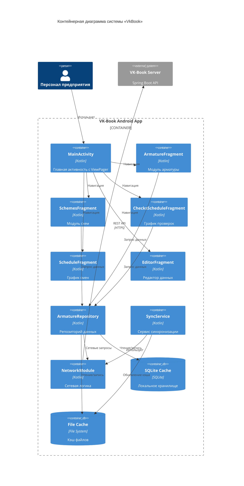

# C4 Container Diagram
## VK-Book Android

## Описание контейнеров

### MainActivity
Главная активность приложения, управляющая навигацией между модулями через ViewPager2.

### Фрагменты
- **ArmatureFragment:** Модуль работы с арматурой
- **SchemesFragment:** Модуль просмотра схем
- **ChecksScheduleFragment:** Модуль графика проверок
- **ScheduleFragment:** Модуль графика смен
- **EditorFragment:** Модуль редактирования данных (административный)

### Репозиторий и сервисы
- **ArmatureRepository:** Абстракция работы с данными
- **SyncService:** Сервис синхронизации с сервером
- **NetworkModule:** Сетевая логика (Retrofit, OkHttp)

### Хранилища данных
- **SQLite Cache:** Локальная база данных для структурированных данных
- **File Cache:** Файловый кэш для Excel и PDF файлов
