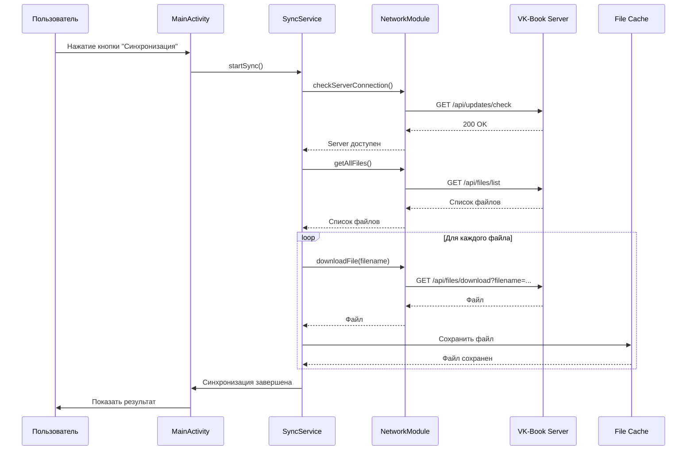
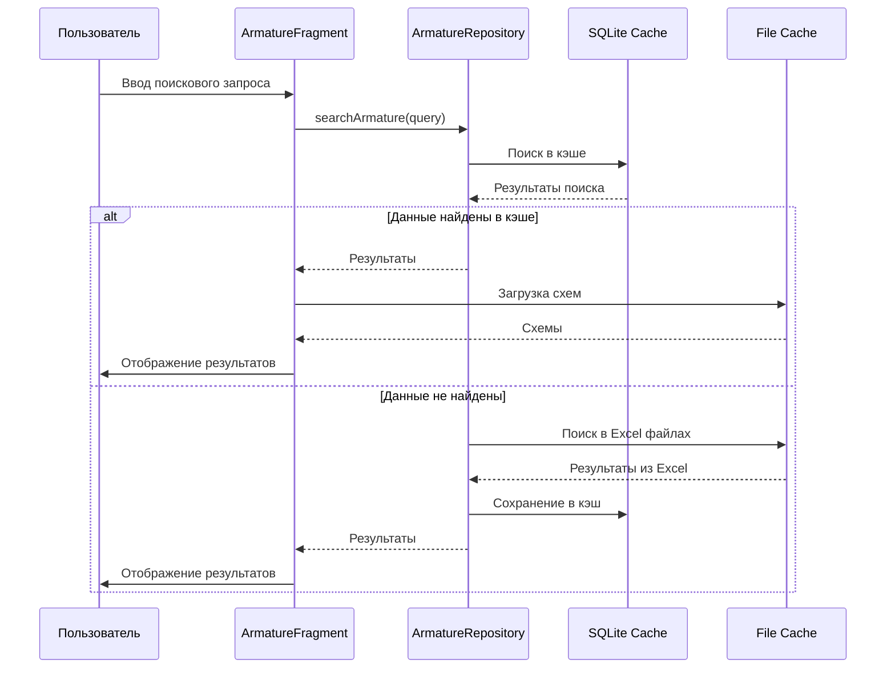
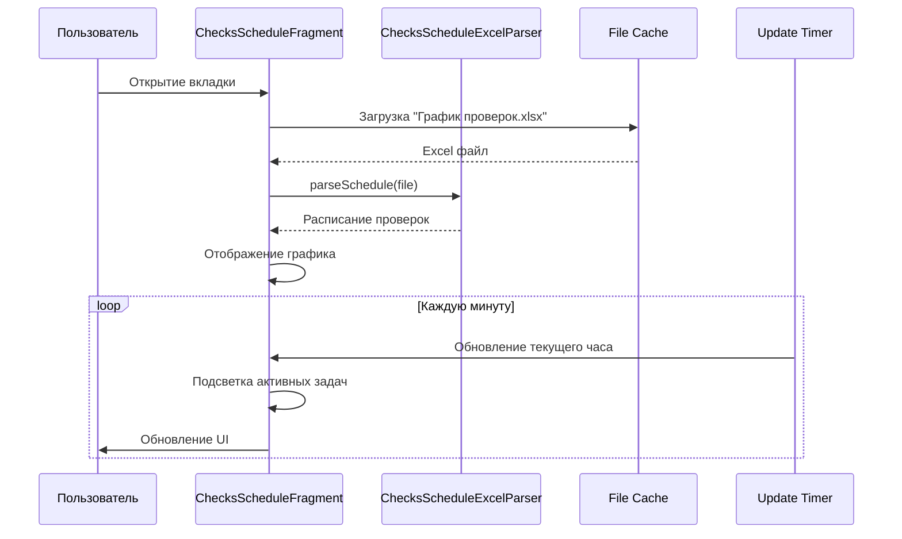
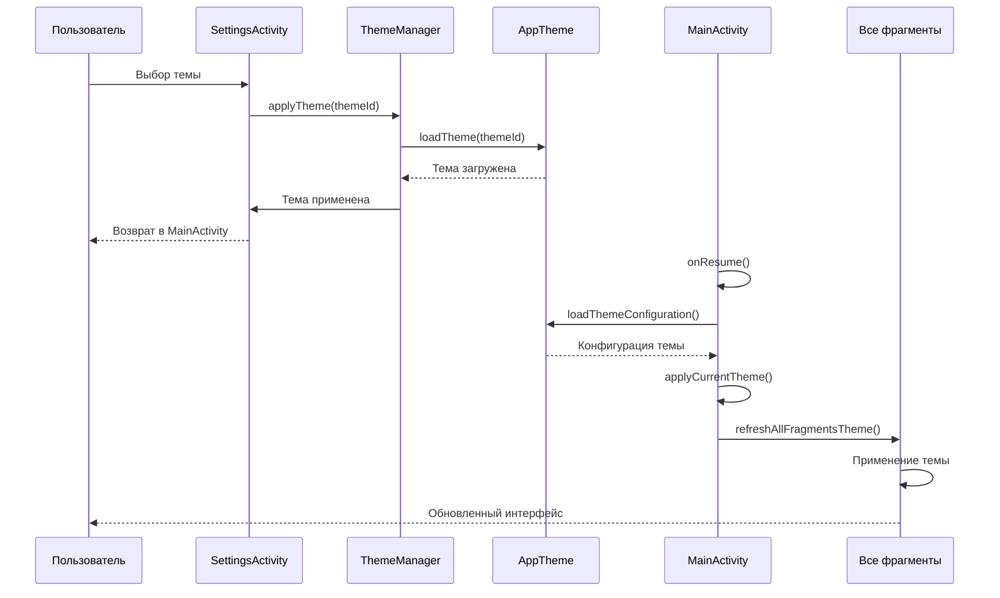

# Sequence Diagrams
## VK-Book Android

## Синхронизация данных с сервером

```mermaid
sequenceDiagram
    participant User as Пользователь
    participant MainActivity as MainActivity
    participant SyncService as SyncService
    participant NetworkModule as NetworkModule
    participant Server as VK-Book Server
    participant FileCache as File Cache

    User->>MainActivity: Нажатие кнопки "Синхронизация"
    MainActivity->>SyncService: startSync()
    SyncService->>NetworkModule: checkServerConnection()
    NetworkModule->>Server: GET /api/updates/check
    Server-->>NetworkModule: 200 OK
    NetworkModule-->>SyncService: Server доступен
    
    SyncService->>NetworkModule: getAllFiles()
    NetworkModule->>Server: GET /api/files/list
    Server-->>NetworkModule: Список файлов
    NetworkModule-->>SyncService: Список файлов
    
    loop Для каждого файла
        SyncService->>NetworkModule: downloadFile(filename)
        NetworkModule->>Server: GET /api/files/download?filename=...
        Server-->>NetworkModule: Файл
        NetworkModule-->>SyncService: Файл
        SyncService->>FileCache: Сохранить файл
        FileCache-->>SyncService: Файл сохранен
    end
    
    SyncService->>MainActivity: Синхронизация завершена
    MainActivity->>User: Показать результат
```

## Поиск арматуры

```mermaid
sequenceDiagram
    participant User as Пользователь
    participant ArmatureFragment as ArmatureFragment
    participant Repository as ArmatureRepository
    participant SQLiteCache as SQLite Cache
    participant FileCache as File Cache

    User->>ArmatureFragment: Ввод поискового запроса
    ArmatureFragment->>Repository: searchArmature(query)
    Repository->>SQLiteCache: Поиск в кэше
    SQLiteCache-->>Repository: Результаты поиска
    
    alt Данные найдены в кэше
        Repository-->>ArmatureFragment: Результаты
        ArmatureFragment->>FileCache: Загрузка схем
        FileCache-->>ArmatureFragment: Схемы
        ArmatureFragment->>User: Отображение результатов
    else Данные не найдены
        Repository->>FileCache: Поиск в Excel файлах
        FileCache-->>Repository: Результаты из Excel
        Repository->>SQLiteCache: Сохранение в кэш
        Repository-->>ArmatureFragment: Результаты
        ArmatureFragment->>User: Отображение результатов
    end
```

## Загрузка графика проверок

```mermaid
sequenceDiagram
    participant User as Пользователь
    participant ChecksFragment as ChecksScheduleFragment
    participant ExcelParser as ChecksScheduleExcelParser
    participant FileCache as File Cache
    participant Timer as Update Timer

    User->>ChecksFragment: Открытие вкладки
    ChecksFragment->>FileCache: Загрузка "График проверок.xlsx"
    FileCache-->>ChecksFragment: Excel файл
    ChecksFragment->>ExcelParser: parseSchedule(file)
    ExcelParser-->>ChecksFragment: Расписание проверок
    
    ChecksFragment->>ChecksFragment: Отображение графика
    
    loop Каждую минуту
        Timer->>ChecksFragment: Обновление текущего часа
        ChecksFragment->>ChecksFragment: Подсветка активных задач
        ChecksFragment->>User: Обновление UI
    end
```

## Применение темы оформления

```mermaid
sequenceDiagram
    participant User as Пользователь
    participant SettingsActivity as SettingsActivity
    participant ThemeManager as ThemeManager
    participant AppTheme as AppTheme
    participant MainActivity as MainActivity
    participant Fragments as Все фрагменты

    User->>SettingsActivity: Выбор темы
    SettingsActivity->>ThemeManager: applyTheme(themeId)
    ThemeManager->>AppTheme: loadTheme(themeId)
    AppTheme-->>ThemeManager: Тема загружена
    ThemeManager->>SettingsActivity: Тема применена
    SettingsActivity-->>User: Возврат в MainActivity
    
    MainActivity->>MainActivity: onResume()
    MainActivity->>AppTheme: loadThemeConfiguration()
    AppTheme-->>MainActivity: Конфигурация темы
    MainActivity->>MainActivity: applyCurrentTheme()
    MainActivity->>Fragments: refreshAllFragmentsTheme()
    Fragments->>Fragments: Применение темы
    Fragments-->>User: Обновленный интерфейс
```
