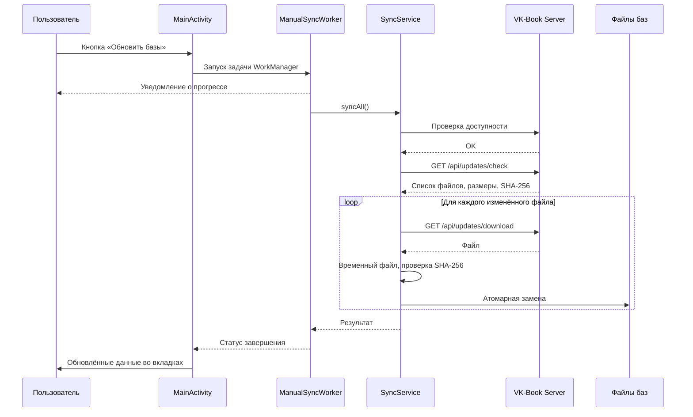
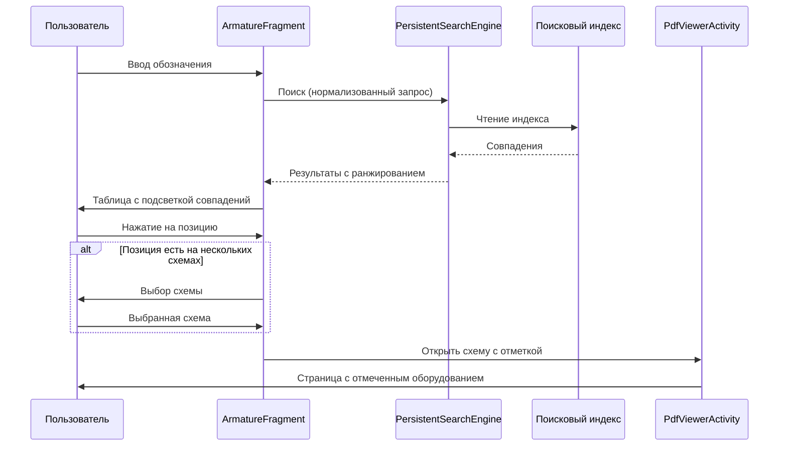
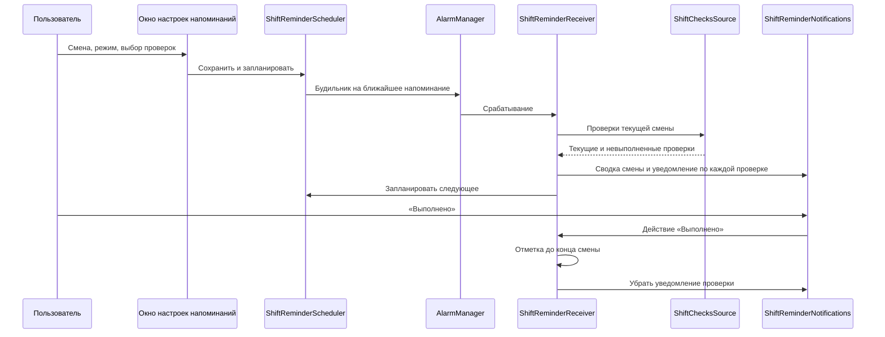

# Sequence Diagrams
## VK-Book Android

## Обновление баз с сервера

```mermaid
sequenceDiagram
    participant User as Пользователь
    participant Main as MainActivity
    participant Worker as ManualSyncWorker
    participant Sync as SyncService
    participant Server as VK-Book Server
    participant Files as Файлы баз

    User->>Main: Кнопка «Обновить базы»
    Main->>Worker: Запуск задачи WorkManager
    Worker-->>User: Уведомление о прогрессе
    Worker->>Sync: syncAll()
    Sync->>Server: Проверка доступности
    Server-->>Sync: OK
    Sync->>Server: GET /api/updates/check
    Server-->>Sync: Список файлов, размеры, SHA-256

    loop Для каждого изменённого файла
        Sync->>Server: GET /api/updates/download
        Server-->>Sync: Файл
        Sync->>Sync: Временный файл, проверка SHA-256
        Sync->>Files: Атомарная замена
    end

    Sync-->>Worker: Результат
    Worker-->>Main: Статус завершения
    Main->>User: Обновлённые данные во вкладках
```

## Поиск оборудования и переход к схеме

```mermaid
sequenceDiagram
    participant User as Пользователь
    participant Table as ArmatureFragment
    participant Search as PersistentSearchEngine
    participant Index as Поисковый индекс
    participant Pdf as PdfViewerActivity

    User->>Table: Ввод обозначения
    Table->>Search: Поиск (нормализованный запрос)
    Search->>Index: Чтение индекса
    Index-->>Search: Совпадения
    Search-->>Table: Результаты с ранжированием
    Table->>User: Таблица с подсветкой совпадений

    User->>Table: Нажатие на позицию
    alt Позиция есть на нескольких схемах
        Table->>User: Выбор схемы
        User->>Table: Выбранная схема
    end
    Table->>Pdf: Открыть схему с отметкой
    Pdf->>User: Страница с отмеченным оборудованием
```

## Напоминание о проверках в смене

```mermaid
sequenceDiagram
    participant User as Пользователь
    participant Settings as Окно настроек напоминаний
    participant Scheduler as ShiftReminderScheduler
    participant Alarm as AlarmManager
    participant Receiver as ShiftReminderReceiver
    participant Checks as ShiftChecksSource
    participant Notify as ShiftReminderNotifications

    User->>Settings: Смена, режим, выбор проверок
    Settings->>Scheduler: Сохранить и запланировать
    Scheduler->>Alarm: Будильник на ближайшее напоминание

    Alarm->>Receiver: Срабатывание
    Receiver->>Checks: Проверки текущей смены
    Checks-->>Receiver: Текущие и невыполненные проверки
    Receiver->>Notify: Сводка смены и уведомление по каждой проверке
    Receiver->>Scheduler: Запланировать следующее

    User->>Notify: «Выполнено»
    Notify->>Receiver: Действие «Выполнено»
    Receiver->>Receiver: Отметка до конца смены
    Receiver->>Notify: Убрать уведомление проверки
```
