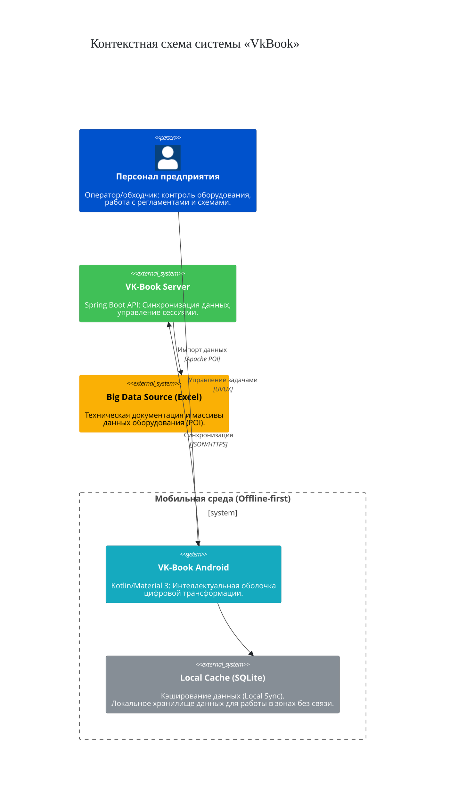

# C4 System Context Diagram
## VK-Book Android

## Описание компонентов

### Персонал предприятия
Операторы и обходчики, которые используют приложение для работы с оборудованием, регламентами и схемами.

### VK-Book Android
Мобильное приложение на Kotlin с Material 3, обеспечивающее цифровую трансформацию рабочих процессов.

### Local Cache (SQLite)
Локальное хранилище данных для работы в офлайн-режиме в экранированных зонах без связи.

### VK-Book Server
Backend API на Spring Boot для синхронизации данных и управления сессиями.

### Big Data Source (Excel)
Источник технических данных в формате Excel, обрабатываемых через Apache POI.
