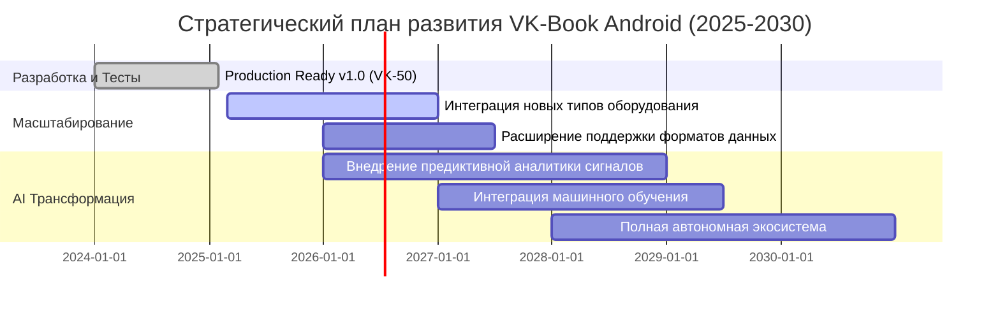

# Product Roadmap
## VK-Book Android (2025-2030)

**Версия:** 1.0  
**Дата:** Февраль 2026

---

## Обзор

Стратегический план развития VK-Book Android на период 2025-2030 годов, включающий этапы масштабирования, интеграции новых функций и внедрения AI-технологий.

---

## Roadmap Timeline

---

## Этап 1: Production Ready v1.0 (2024-2025)

**Статус:** ✅ Завершено

### Цели

- Разработка базового функционала для объекта ВК-50
- Обеспечение стабильности и надежности работы
- Достижение Production Ready статуса

### Ключевые достижения

- ✅ Реализация 6 основных модулей
- ✅ Offline-first архитектура
- ✅ Интеграция с Apache POI для работы с Excel
- ✅ Система синхронизации с сервером
- ✅ 35 автоматических тестов
- ✅ Оптимизация производительности (+92% экономии CPU)
- ✅ 0 ошибок Lint

### Метрики

- Время доступа к данным: < 60 секунд
- Поиск арматуры: < 5 минут
- Покрытие тестами: 35 тестов
- Статус: Production Ready

---

## Этап 2: Масштабирование (2025-2027)

**Статус:** 🔄 В процессе

### 2.1 Интеграция новых типов оборудования (2025-2026)

**Цели:**
- Расширение поддержки различных типов оборудования
- Интеграция с новыми источниками данных
- Улучшение системы поиска и фильтрации

**Ключевые задачи:**
- [ ] Поддержка дополнительных типов арматуры
- [ ] Интеграция с системами мониторинга оборудования
- [ ] Расширение базы данных сигналов БЩУ
- [ ] Улучшение системы координат на схемах

**Метрики успеха:**
- Поддержка 3+ новых типов оборудования
- Увеличение базы данных на 50%
- Улучшение точности поиска на 20%

### 2.2 Расширение поддержки форматов данных (2026-2027)

**Цели:**
- Поддержка дополнительных форматов файлов
- Улучшение импорта/экспорта данных
- Интеграция с внешними системами

**Ключевые задачи:**
- [ ] Поддержка формата CSV для импорта данных
- [ ] Интеграция с системами планирования ресурсов
- [ ] Экспорт данных в различные форматы
- [ ] API для интеграции с внешними системами

**Метрики успеха:**
- Поддержка 5+ форматов данных
- Успешная интеграция с 2+ внешними системами

---

## Этап 3: AI Трансформация (2026-2030)

**Статус:** 📋 Запланировано

### 3.1 Внедрение предиктивной аналитики сигналов (2026-2028)

**Цели:**
- Использование AI для анализа сигналов БЩУ
- Предиктивное обслуживание оборудования
- Раннее обнаружение аномалий

**Ключевые задачи:**
- [ ] Разработка модели машинного обучения для анализа сигналов
- [ ] Интеграция с системами сбора данных
- [ ] Реализация системы предупреждений
- [ ] Визуализация трендов и прогнозов

**Метрики успеха:**
- Точность предсказаний: > 85%
- Раннее обнаружение аномалий: за 24+ часа до события
- Сокращение простоев оборудования: > 30%

### 3.2 Интеграция машинного обучения (2027-2029)

**Цели:**
- Автоматизация процессов проверки оборудования
- Оптимизация графиков проверок
- Персонализация интерфейса для пользователей

**Ключевые задачи:**
- [ ] Разработка рекомендательной системы для графиков проверок
- [ ] Автоматическое определение оптимальных интервалов проверок
- [ ] Персонализация интерфейса на основе поведения пользователя
- [ ] Интеграция с системами компьютерного зрения для анализа схем

**Метрики успеха:**
- Автоматизация 50% процессов проверки
- Улучшение эффективности на 25%
- Удовлетворенность пользователей: > 90%

### 3.3 Полная автономная экосистема (2028-2030)

**Цели:**
- Создание полностью автономной экосистемы
- Интеграция всех компонентов системы
- Реализация концепции "умного объекта"

**Ключевые задачи:**
- [ ] Интеграция всех модулей в единую экосистему
- [ ] Реализация автоматического принятия решений
- [ ] Разработка системы самообучения
- [ ] Создание единого дашборда для управления объектом

**Метрики успеха:**
- Автоматизация 80% процессов
- Сокращение времени принятия решений: > 50%
- Повышение эффективности объекта: > 40%

---

## Приоритизация функций

### Высокий приоритет

1. Интеграция новых типов оборудования
2. Внедрение предиктивной аналитики сигналов
3. Улучшение системы поиска и фильтрации

### Средний приоритет

1. Расширение поддержки форматов данных
2. Интеграция машинного обучения
3. API для интеграции с внешними системами

### Низкий приоритет

1. Персонализация интерфейса
2. Интеграция с системами компьютерного зрения
3. Разработка системы самообучения

---

## Риски и митигация

### Технические риски

| Риск | Вероятность | Влияние | Митигация |
|------|-------------|---------|-----------|
| Сложность интеграции AI | Высокая | Высокое | Поэтапное внедрение, пилотные проекты |
| Производительность ML моделей | Средняя | Среднее | Оптимизация моделей, кэширование |
| Совместимость с существующими системами | Средняя | Высокое | Тщательное тестирование, обратная совместимость |

### Бизнес-риски

| Риск | Вероятность | Влияние | Митигация |
|------|-------------|---------|-----------|
| Изменение требований | Средняя | Среднее | Гибкая архитектура, регулярные ретроспективы |
| Бюджетные ограничения | Низкая | Высокое | Приоритизация функций, поэтапное финансирование |

---

## Метрики успеха Roadmap

### Технические метрики

- Поддержка новых типов оборудования: 3+ типов к 2026 году
- Точность AI предсказаний: > 85% к 2028 году
- Автоматизация процессов: > 80% к 2030 году

### Бизнес-метрики

- Сокращение простоев оборудования: > 30% к 2028 году
- Повышение эффективности объекта: > 40% к 2030 году
- Удовлетворенность пользователей: > 90% к 2029 году

---

## Заключение

Roadmap VK-Book Android представляет собой стратегический план развития продукта на период 2025-2030 годов, направленный на:

1. **Масштабирование** существующего функционала
2. **Интеграцию AI-технологий** для повышения эффективности
3. **Создание автономной экосистемы** для управления объектом

Каждый этап имеет четкие цели, задачи и метрики успеха для измерения прогресса.
